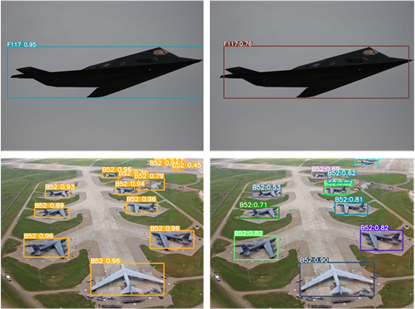

# TensorRT优化

**NVIDIA TensorRT ™** 是基于Nvidia CUDA编程模型的SDK，主要用于高性能深度学习推理[^1]。具体优化结构如图1所示，TensorRT提供api和解析器来从所有主要的深度学习框架中导入经过训练的模型，经过权重与激活精度校准、层与张量融合、内核自动调整、动态张量显存和多流执行，然后生成可部署在各种环境的优化运行时引擎[^2]。

图1.TensorRT优化原理

在我们的项目中，为了使yolo训练的模型进一步轻量化，我们将模型送入TensorRT中优化产生Engine引擎，然后再应用在GPU推理中，优化流程如图2所示。在最后的GPU推理阶段，优化后的引擎被反序列化解析，当推理请求发出时，输入数据从CPU复制到GPU，推理完成后再以异步方式返回结果至CPU。

图2.TensorRT处理模型流程图

# 实验结果

我们的实验基于Military Aircraft Detection Dataset，该数据集包含36种，5062张军用飞机图片，包含中、美、俄、欧等国家热门机型[^3]。

最终，经过TensorRT加速后的模型虽然会损失一定的精度，但检测速度得到了极大的提升。采用FP16精度对模型优化后的对比效果如图3所示：

图3.未使用TensorRT优化（左）与使用TensorRT优化（右）检测对比

# 参考文献

[^1]:Nvidia.NVIDIA TensorRT 可编程推理加速器. [EB/OL].https://developer.nvidia.cn/zh-cn/tensorrt. 2021
[^2]: Houman Abbasian et al.Speeding Up Deep Learning Inference UsingTensorRT. [EB/OL].https://developer.nvidia.com/blog/speeding-up-deep-learning-inference-using-tensorrt. 2020.
[^3]: https://www.kaggle.com/a2015003713/militaryaircraftdetectiondataset

